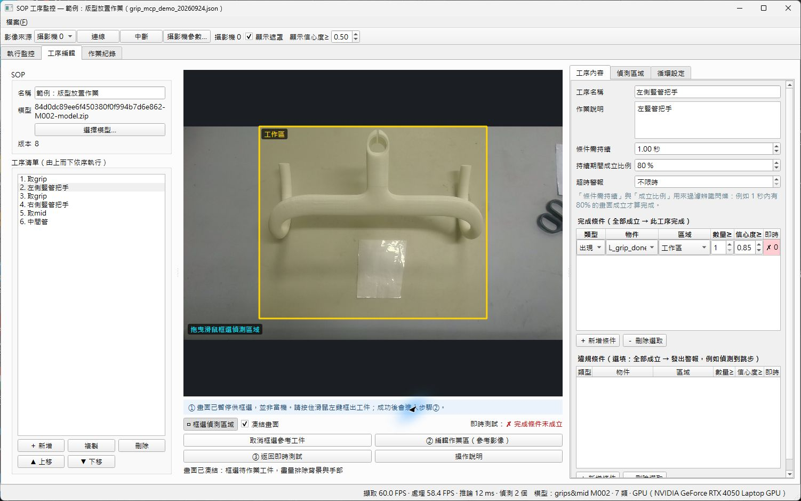
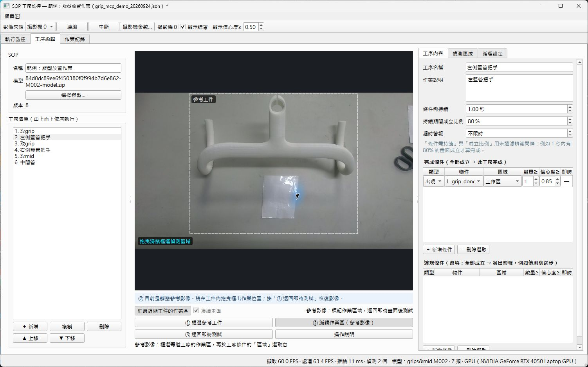
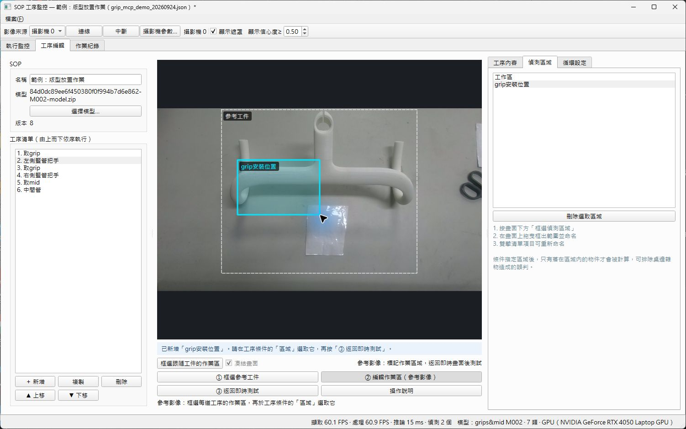
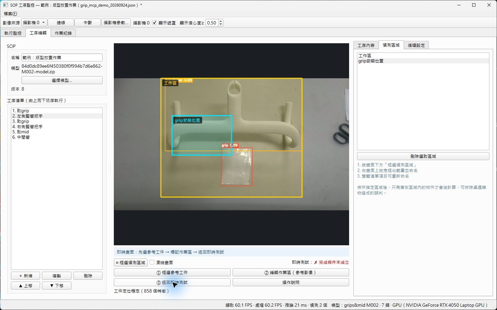
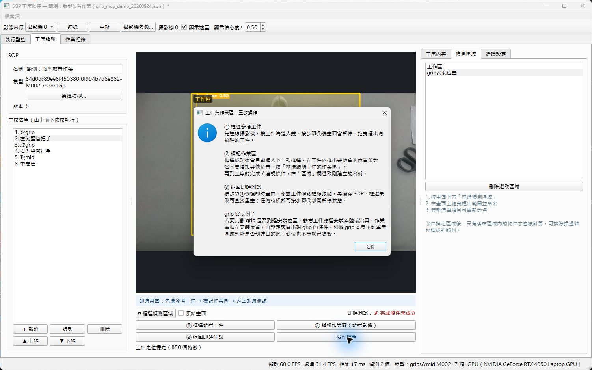

# grip 工件程序操作說明

## 建議：使用車把手快速設定

「工序編輯」左側的工序清單是整個專案的主流程，切換總覽、位置跟隨、安裝位置、工序條件或循環設定時都會保留。先在清單選擇要處理的工序；雙擊工序可直接進入條件編輯。右側各功能獨立操作，不會同時堆疊所有工具。第一次設定可在總覽按藍色的「開始引導設定」，依畫面完成：

1. **車把手**：框選完整車把手，包含左右端與中央可辨識特徵。
2. **安裝位置**：在靜態車把手影像連續拖曳位置；每次輸入位置名稱並選擇到位物件，系統會自動建立一道安裝流程。
3. **即時驗證**：移動車把手，確認位置框同步跟隨，再按「完成並儲存 SOP」。

車把手的跟隨基準只在內部用於計算，不會顯示成偵測區域。安裝位置可畫在參考影像的任何位置，不必位於先前框選的跟隨基準內。需要重畫時，可在引導中按「重新框選車把手」，或展開進階設定後按「清除主工件設定」。

日常操作只需開啟 SOP、放入車把手。「開始作業」始終可以操作，定位狀態只作提示；位置尚未確認時，跟隨位置的條件會暫停累積，定位恢復後再重新累積。需要修改信心度與持續時間時進入「工序條件」；需要修改下一輪規則時進入「循環設定」。

安裝位置必須跟隨車把手主工件；grip、mid 等零件由模型辨識框追蹤。若讓安裝位置跟隨待安裝零件，零件尚未到位時也會一直位於自己的框內，無法判斷是否完成安裝。

## 多位置編輯與即時跟隨

「執行監控」待機時也會預覽偵測區域，不必先按開始作業。固定區域直接顯示；跟隨本體的區域在定位正常時顯示即時位置，定位失效時顯示最後位置或原始設定位置。右側會列出區域顯示數量與定位狀態。正式作業使用背景判定引擎的定位結果，待機預覽不會累積完成條件。作業進行中修改 SOP，要停止後重新開始才會套用。

位置跟隨會以特徵配對、短期光流及輪廓模板交叉恢復。單一模糊畫面不會清空追蹤狀態；短暫失效時保留最後位置，連續失效才改為橘色虛線「待定位」。待定位畫面只供操作員確認，完成條件仍會暫停累積。

執行監控的「畫面顯示」只有兩種模式，預設為「逐步」：

- **逐步｜目前流程**：只輸出目前流程完成條件與違規條件相關的物件和安裝位置。流程完成後舊內容立即隱藏，換成下一流程。畫面會列出目前流程、物件及位置。
- **全開｜所有結果**：輸出模型的所有辨識結果與全部有效位置，適合設定和除錯；畫面會列出目前偵測物件數與位置顯示數。

模式只控制畫面輸出。模型仍辨識完整畫面，背景判定也保留全部結果，因此逐步模式仍能偵測提前出現物件等違規狀況。

1. 設定參考本體後，在「偵測區域」按「＋ 新增位置」，分別建立左側、右側等安裝位置。
2. 選取位置後按「編輯位置」：畫面會暫停，拖曳框內移動，拖動四角縮放。Esc 可取消當次拖曳；復原／重做按鈕可還原區域修改（最多 50 筆，重新載入 SOP 或修改條件後清除歷史）。
3. 「複製位置」建立相同大小的框，初始與原框重疊；把選取框拖到另一處，再雙擊清單名稱改名。
4. 「套用到目前工序…」選擇模型物件，加入該位置的出現條件。條件表可再調整數量與信心度。
5. 依序安裝：每個位置各設一個工序。順序不限：同一工序加入多個位置，選「全部位置成立」；此模式要求所有條件在判定時同時滿足，不會記住已移除的零件。替代安裝位置可選「任一位置成立即可」。
6. 按「完成編輯／返回即時」，查看清單下方各位置的狀態，再儲存 SOP。

固定畫面區域不會跟隨物件。既有固定區域可在本體定位穩定、即時畫面中的框正確覆蓋安裝位置時，按「改為跟隨本體」。系統會將目前位置轉為本體座標；超出本體範圍時不接受轉換。

跟隨定位採用逐幀光流量測與定期參考特徵校正，支援平移、平面旋轉和等比縮放。短期特徵配對失敗時只使用通過雙向驗證的光流，最多 8 幀後須重新配對；定位遺失時不沿用舊座標，也不以失去辨識當作物件消失。光滑無紋理本體、完全遮擋、大幅立體翻轉仍可能無法定位，需改善可見特徵或重新選取參考本體。

下列截圖記錄先前的三步操作介面；新增的多位置按鈕依本節操作。

這份說明以 `grip_mcp_demo_20260924.json` 示範「取 grip → 框選參考工件 → 標記作業區 → 返回即時測試」的完整操作。畫面中的凍結是正常狀態：框選時程式會暫停影像，避免拖曳期間畫面移動。

## 操作步驟

### 1. 先讓工件完整入鏡

連線攝影機，將本體與 grip 的安裝位置放在畫面中央並保持穩定。確認影像清楚後，按 `① 框選參考工件`。

### 2. 框選參考工件

按住滑鼠左鍵，從工件左上角拖到右下角。參考框應包含會用來定位的本體或治具，並保留完整外形與足夠紋理。框選完成後，程式會自動切換到靜態參考影像。

### 3. 在參考影像內標記作業區

在工件內拖曳要檢查的位置，例如 grip 的安裝位置。放開滑鼠後輸入區域名稱；本次示範命名為 `grip安裝位置`。若還有其他位置，繼續拖曳建立更多區域。

接著在右側工序的完成條件或違規條件中，把「區域」欄選成剛建立的名稱。這樣物件只會在指定作業區內被計算，可降低桌邊雜物造成的誤判。

### 4. 返回即時畫面驗證跟隨

按 `③ 返回即時測試`。移動工件或 grip，確認參考工件框與作業區框會跟著工件移動，再按 `Ctrl+S` 儲存 SOP。

若框選不理想，可重新按 `① 框選參考工件`；任何暫停或框選狀態都可按 `③ 返回即時測試` 離開。

### 5. 需要時查看內建操作說明

按 `操作說明` 可開啟三步操作與 grip 安裝判定提示。

## grip 到位判定的使用原則

若要判斷 grip 是否到達安裝位置，參考工件應選安裝本體或治具，作業區框在安裝位置，再設定「該區出現 grip」的完成條件。跟隨 grip 本身只能提供位置追蹤，不能單靠區域判斷是否已到達目的地；到位也不等於已鎖緊，鎖緊狀態仍需另外設定可觀察的條件。

## 示範檔案

- 示範 SOP：`grip_mcp_demo_20260924.json`
- 截圖資料夾：`docs/operation-guide/screenshots/`
